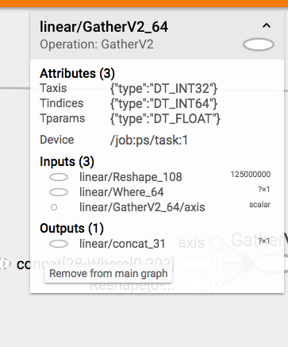
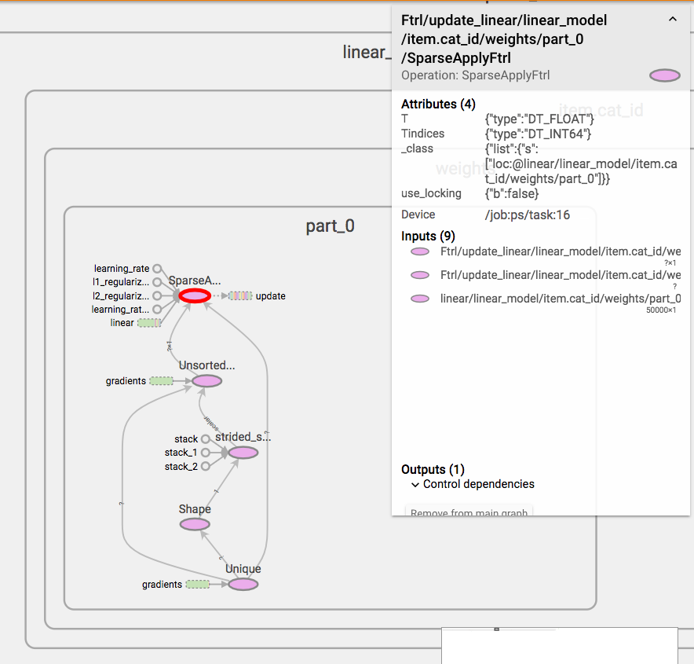
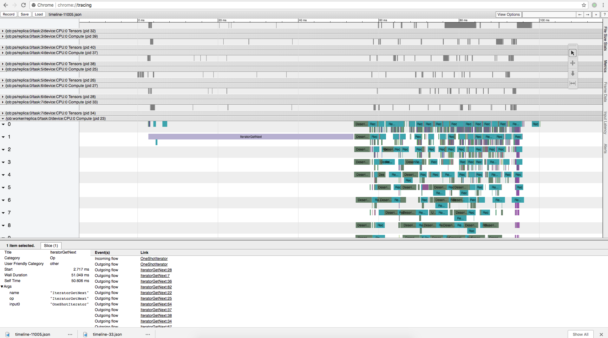
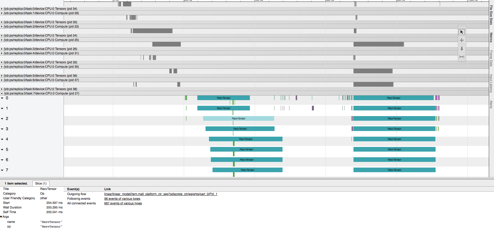
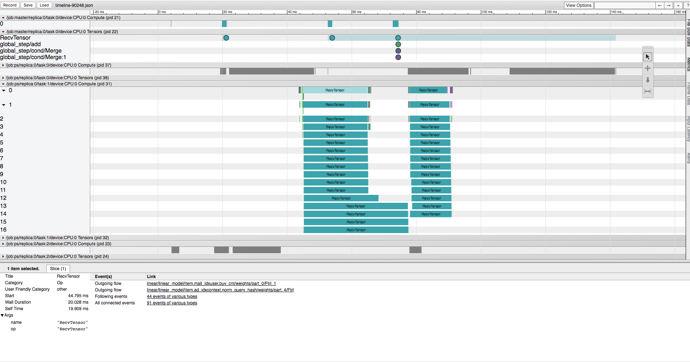
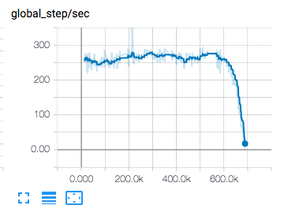

---

layout: post

title: "分布式TensorFlow在Sparse模型上的实践"

date: "2018-05-20 10:00:00 +0800"

---


# 前言

如果你去搜TensorFlow教程，或者分布式TensorFlow教程，可能会搜到很多mnist或者word2vec的模型，但是对于Sparse模型(LR, WDL等)，研究的比较少，对于分布式训练的研究就更少了。最近刚刚基于分布式TensorFlow上线了一个LR的CTR模型，支持百亿级特征，训练速度也还不错，故写下一些个人的心得体会，如果有同学也在搞类似的模型欢迎一起讨论。


# 训练相关

## 集群setup

分布式TensorFlow中有三种角色: Master(Chief), PS和Worker. 其中Master负责训练的启动和停止，全局变量的初始化等；PS负责存储和更新所有训练的参数(变量); Worker负责每个mini batch的梯度计算。如果去网上找分布式TensorFlow的教程，一个普遍的做法是使用Worker 0作为Master, 例如[这里](https://github.com/tensorflow/tensorflow/blob/master/tensorflow/tools/dist_test/python/mnist_replica.py)官方给出的例子。我个人比较建议把master独立出来，不参与训练，只进行训练过程的管理, 这样有几个好处:


1. 独立出Master用于训练的任务分配，状态管理，Evaluation, Checkpoint等，可以让代码更加清晰。

2. Master由于任务比worker多，往往消耗的资源如CPU/内存也和worker不一样。独立出来以后，在k8s上比较容易分配不同的资源。

3. 一些训练框架如Kubeflow使用Master的状态来确定整个任务的状态。


## 训练样本的分配

在sparse模型中，采用分布式训练的原因一般有两种:

1. 数据很多，希望用多个worker加速。

2. 模型很大，希望用多个PS来加速。


前一个就涉及到训练样本怎么分配的问题。从目前网上公开的关于分布式TF训练的讨论，以及官方分布式的文档和教程中，很少涉及这个问题，因此最佳实践并不清楚。我目前的解决方法是引入一个zookeeper进行辅助。由master把任务写到zookeeper, 每个worker去读取自己应该训练哪些文件。基本流程如下:

```python

# master

file_list = list_dir(flags.input_dir)

for worker, worker_file in zip(workers, file_list):

    self.zk.create(f'/jobs/{worker}', ','.join(worker_file).encode('utf8'), makepath=True)

# start master session ...


# worker

wait_for_jobs = Semaphore(0)

@self.zk.DataWatch(f"/jobs/{worker}")

def watch_jobs(jobs, _stat, _event):

    if jobs:

        data_paths = jobs.decode('utf8').split(',')

        self.train_data_paths = data_paths

        wait_for_jobs.release()


wait_for_jobs.acquire()

# start worker session ...

```

引入zookeeper之后，文件的分配就变得非常灵活，并且后续也可以加入使用master监控worker状态等功能。


## 使用device_filter

启动分布式TF集群时，每个节点都会启动一个Server. 默认情况下，每个节点都会跟其他节点进行通信，然后再开始创建Session. 在集群节点多时，会带来两个问题：

1. 由于每个节点两两通信，造成训练的启动会比较慢。

2. 当某些worker挂掉重启（例如因为内存消耗过多），如果其他某些worker已经跑完结束了，重启后的worker就会卡住，一直等待其他的worker。此时会显示log: `CreateSession still waiting for response from worker: /job:worker/replica:0/task:x`.


解决这个问题的方法是使用device filter. 例如:

```python

config = tf.ConfigProto(device_filters=["/job:ps", f"/job:{self.task_type}/task:{self.task_index}"])


with tf.train.MonitoredTrainingSession(

    ...,

    config=config

):

    ...

```

这样，每个worker在启动时就只会和所有的PS进行通信，而不会和其他worker进行通信，既提高了启动速度，又提高了健壮性。


## 给session.run加上timeout

有时在一个batch比较大时，由于HDFS暂时不可用或者延时高等原因，有可能会导致`session.run`卡住。可以给它加一个timeout来提高程序的健壮性。

```python

session.run(fetches, feed_dict, options=tf.RunOptions(timeout_in_ms=timeout))

```


## 优雅的停止训练

在很多分布式的例子里(例如[官方](https://github.com/tensorflow/tensorflow/blob/master/tensorflow/tools/dist_test/python/mnist_replica.py)的这个)，都没有涉及到训练怎么停止的问题。通常的做法都是这样:

```python

server = tf.train.Server(

        cluster, job_name=FLAGS.job_name, task_index=FLAGS.task_index)

    if FLAGS.job_name == "ps":

        server.join()

```

这样的话，一旦开始训练，PS就会block, 直到训练结束也不会停止，只能暴力删除任务(顺便说一下，MXNet更粗暴，PS运行完`import mxnet`就block了)。前面我们已经引入了zookeeper, 所以可以相对比较优雅的解决这个问题。master监控worker的状态，当worker全部完成后，master设置自己的状态为完成。PS和worker检测到master完成后，就结束自己。

```python

def join():

    while True:

        status = self.zk.get_async('/status/master').get(timeout=3)

        if status == 'done':

            break

        time.sleep(10)


# master

for worker in workers:

    status = self.zk.get_async(f'/status/worker/{worker}').get(timeout=3)

    update_all_workers_done()

if all_workers_done:

    self.zk.create('/status/master', b'done', makepath=True)


# ps

join()


# worker

while has_more_data:

    train()

self.zk.set('/status/worker/{worker}', b'done')

join()

```


## Kubeflow的使用

[Kubeflow](https://github.com/kubeflow/kubeflow)是一个用于分布式TF训练提交任务的项目。它主要由两个部分组成，一是[ksonnet](https://ksonnet.io/)，一是[tf-operator](https://github.com/kubeflow/tf-operator)。ksonnet主要用于方便编写k8s上的manifest, tf-operator是真正起作用的部分，会帮你设置好`TF_CONFIG`这个关键的环境变量，你只需要设置多少个PS, 多少个worker就可以了。个人建议用ksonnet生成一个skeleton, 把tf-operator的manifest打印出来(使用`ks show -c default`), 以后就可以跳过ksonnet直接用tf-operator了。因为k8s的manifest往往也需要修改很多东西，最后还是要用程序生成，没必要先生成ksonnet再生成yaml.


## Estimator的局限性

一开始我使用的是TF的高级API `Estimator`, 参考[这里](https://www.tensorflow.org/tutorials/wide_and_deep)的WDL模型. 后来发现`Estimator`有一些问题，没法满足目前的需要。


一是性能问题。我发现同样的linear model, 手写的模型是Estimator的性能的5-10倍。具体原因尚不清楚，有待进一步调查。


UPDATE: 性能问题的原因找到了，TL;DR: 在sparse场景使用Dataset API时, 先batch再map(parse_example)会更快。详情见: https://stackoverflow.com/questions/50781373/using-feed-dict-is-more-than-5x-faster-than-using-dataset-api


二灵活性问题。`Estimator` API目前支持分布式的接口是[train_and_evaluate](https://www.tensorflow.org/api_docs/python/tf/estimator/train_and_evaluate), 它的逻辑可以从源代码里看到:

```python

# training.py

def run_master(self):

    ...

    self._start_distributed_training(saving_listeners=saving_listeners)


    if not evaluator.is_final_export_triggered:

        logging.info('Training has already ended. But the last eval is skipped '

                    'due to eval throttle_secs. Now evaluating the final '

                    'checkpoint.')

        evaluator.evaluate_and_export()


# estimator.py

def export_savedmodel(...):

    ...

    with tf_session.Session(config=self._session_config) as session:

        saver_for_restore = estimator_spec.scaffold.saver or saver.Saver(

            sharded=True)

        saver_for_restore.restore(session, checkpoint_path)

        ...

        builder = ...

        builder.save(as_text)

```

可以看到`Estimator`有两个问题，一是运行完才进行evaluate, 但在大型的sparse model里，训练一轮可能要几个小时，我们希望一边训练一边evaluate, 在训练过程中就能尽快的掌握效果的变化(例如master只拿到test set, worker只拿到training set, 这样一开始就能evaluate)。二是每次导出模型时，`Estimator` API会新建一个session, 加载最近的一个checkpoint, 然后再导出模型。但实际上，一个sparse模型在TF里耗的内存可能是100多G，double一下会非常浪费，而且导出checkpoint也极慢，也是需要避免的。基于这两个问题，我暂时没有使用Estimator来进行训练。


## 使用feature column(但不使用Estimator)

虽然不能用`Estimator`, 但是使用feature column还是完全没有问题的。不幸的是网上几乎没有人这么用，所以我把我的使用方法分享一下，这其实也是`Estimator`的源代码里的使用方式:

```python

# define feature columns as usual

feature_columns = ...

example = TFRecordDataset(...).make_one_shot_iterator().get_next()

parsed_example = tf.parse_example(example, tf.feature_column.make_parse_example_spec(feature_columns))

logits = tf.feature_column.linear_model(

    features=parsed_example,

    feature_columns=feature_columns,

    cols_to_vars=cols_to_vars

)

```

`parse_example`会把`TFRecord`解析成一个feature dict, key是feature的名称，value是feature的值。[tf.feature_column.linear_model](https://www.tensorflow.org/api_docs/python/tf/feature_column/linear_model)这个API会自动生成一个线性模型，并把变量(weight)的reference, 存在`cols_to_vars`这个字典中。如果使用dnn的模型，可以参考[tf.feature_column.input_layer](https://www.tensorflow.org/api_docs/python/tf/feature_column/input_layer)这个API, 用法类似，会把feature dict转换成一个行向量。


## 模型导出

使用多PS时，常见的做法是使用`tf.train.replica_device_setter`来把不同的变量放在不同的PS节点上。有时一个变量也会很大(这在sparse模型里很常见)，也需要拆分到不同的PS上。这时候就需要使用partitioner:

```python

partitioner = tf.min_max_variable_partitioner(

    max_partitions=variable_partitions,

    min_slice_size=64 << 20)

with tf.variable_scope(

    ...,

    partitioner = partitioner

):

    # define model

```

由于TensorFlow不支持sparse weight(注意: 跟sparse tensor是两码事，这里指的是被训练的变量不能是sparse的), 所以在PS上存的变量还是dense的，比如你的模型里有100亿的参数，那PS上就得存100亿。但实际上对于sparse模型，大部分的weight其实是0，最终有效的weight可能只有0.1% - 1%. 所以可以做一个优化，只导出非0参数:

```python

indices = tf.where(tf.not_equal(vars_concat, 0))

values = tf.gather(vars_concat, indices)

shape = tf.shape(vars_concat)

self.variables[column_name] = {

    'indices': indices,

    'values': values,

    'shape': shape,

}

```

这样就把变量的非0下标，非0值和dense shape都放进了`self.variables`里，之后就只导出`self.variables`即可。


此外, 在多PS的时候，做checkpoint的时候一定要记得enable sharding:

```python

saver = tf.train.Saver(sharded=True, allow_empty=True)

...

```

这样在master进行checkpoint的时候，每个PS会并发写checkpoint文件。否则，所有参数会被传到master上进行集中写checkpoint, 消耗内存巨大。


### 导出优化

前面提到的导出非0参数的方法仍有一个问题，就是会把参数都传到一台机器(master)上，计算出非0再保存。这一点可以由grafana上的监控验证:


可以看到，每隔一段时间进行模型导出时，master的网络IO就会达到一个峰值，是平时的好几倍。如果能把non_zero固定到PS上进行计算，则没有这个问题。代码如下:


```python

for var in var_or_var_list:

    var_shape = var._save_slice_info.var_shape

    var_offset = var._save_slice_info.var_offset

    with tf.device(var.device):

        var_ = tf.reshape(var, [-1])

        var_indices = tf.where(tf.not_equal(var_, 0))

        var_values = tf.gather(var_, var_indices)


    indices.append(var_indices + var_offset[0])

    values.append(var_values)

indices = tf.concat(indices, axis=0)

                    values = tf.concat(values, axis=0)

```

进行了如上修改之后，master的网络消耗变成下图:


参考Tensorboard, 可以看到gather操作确实被放到了PS上进行运算:





## 模型上线

我们目前在线上prediction时没有使用tf-serving, 而是将变量导出用Java服务进行prediction. 主要原因还是TF的PS不支持sparse存储，模型在单台机器存不下，没法使用serving.

在自己实现LR的prediction时，要注意验证线上线下的一致性，有一些常见的坑，比如没加bias, default_value没处理，等等。


## 使用TensorBoard来理解模型

在训练时用TensorBoard来打出Graph，对理解训练的细节很有帮助。例如，我们试图想象这么一个问题：在分布式训练中，参数的更新是如何进行的？以下有两种方案:


1. worker计算gradients, ps合并gradients并进行更新

2. worker计算gradients, 计算应该update成什么值，然后发给ps进行更新


到底哪个是正确的？我们看一下TensorBoard就知道了:



可以看到，FTRL的Operation是在PS上运行的。所以是第一种。


## Metrics

在TensorFlow中有一系列[metrics](https://www.tensorflow.org/api_docs/python/tf/metrics), 例如accuracy, AUC等等，用于评估训练的指标。需要注意的是TensorFlow中的这些metrics都是在求历史平均值，而不是当前batch。所以如果训练一开始就进行评估，使用TensorFlow的AUC和Sklearn的AUC，会发现TensorFlow的AUC会低一些，因为TensorFlow的AUC其实是考虑了历史的所有样本。正因如此`Estimator`的evaluate才会有一个`step`的参数，例如运行100个step，就会得到这100个batch上的metric.


# 性能相关

## profiling

要进行性能优化，首先必须先做profiling。可以使用`tf.train.ProfilerHook`来进行. 

```python

hooks = [tf.train.ProfilerHook(save_secs=60, output_dir=profile_dir, show_memory=True, show_dataflow=True)]

```

之后会写出timeline文件，可以使用chrome输入`chrome://tracing`来打开。


我们来看一个例子:


上图中`IteratorGetNext`占用了非常长的时间。这其实是在从HDFS读取数据。我们加入`prefetch`后，profile变成下面这个样子:



可以看到，加入prefetch以后HDFS读取延时和训练时间在相当的数量级，延时有所好转。


另一个例子:



可以看到, `RecvTensor`占用了大部分时间，说明瓶颈在PS上。经调查发现是partition太多(64)个而PS只有8个，造成传输数据效率下降。调整partition数量后变成如下:




## 使用Grafana进行性能监控

可以使用`Grafana`和`heapster`来进行集群节点以及Pod的监控，查看CPU,内存,网络等性能指标。

```yaml

apiVersion: extensions/v1beta1

kind: Deployment

metadata:

  name: monitoring-grafana

  namespace: kube-system

spec:

  replicas: 1

  template:

    metadata:

      labels:

        task: monitoring

        k8s-app: grafana

    spec:

      containers:

      - name: grafana

        image: k8s.gcr.io/heapster-grafana-amd64:v4.4.3

        ports:

        - containerPort: 3000

          protocol: TCP

        volumeMounts:

        - mountPath: /etc/ssl/certs

          name: ca-certificates

          readOnly: true

        - mountPath: /var

          name: grafana-storage

        env:

        - name: INFLUXDB_HOST

          value: monitoring-influxdb

        - name: GF_SERVER_HTTP_PORT

          value: "3000"

          # The following env variables are required to make Grafana accessible via

          # the kubernetes api-server proxy. On production clusters, we recommend

          # removing these env variables, setup auth for grafana, and expose the grafana

          # service using a LoadBalancer or a public IP.

        - name: GF_AUTH_BASIC_ENABLED

          value: "false"

        - name: GF_AUTH_ANONYMOUS_ENABLED

          value: "true"

        - name: GF_AUTH_ANONYMOUS_ORG_ROLE

          value: Admin

        - name: GF_SERVER_ROOT_URL

          # If you're only using the API Server proxy, set this value instead:

          # value: /api/v1/namespaces/kube-system/services/monitoring-grafana/proxy

          value: /

      volumes:

      - name: ca-certificates

        hostPath:

          path: /etc/ssl/certs

      - name: grafana-storage

        emptyDir: {}

---

apiVersion: v1

kind: Service

metadata:

  labels:

    # For use as a Cluster add-on (https://github.com/kubernetes/kubernetes/tree/master/cluster/addons)

    # If you are NOT using this as an addon, you should comment out this line.

    kubernetes.io/cluster-service: 'true'

    kubernetes.io/name: monitoring-grafana

  name: monitoring-grafana

  namespace: kube-system

spec:

  # In a production setup, we recommend accessing Grafana through an external Loadbalancer

  # or through a public IP.

  # type: LoadBalancer

  # You could also use NodePort to expose the service at a randomly-generated port

  # type: NodePort

  ports:

  - port: 80

    targetPort: 3000

  selector:

    k8s-app: grafana

```

部署到k8s集群之后，就可以分节点/Pod查看性能指标了。


## ps/worker数量的设置

PS和worker的数量需要如何设置？这个需要大量的实验，没有绝对的规律可循。一般来说sparse模型由于每条样本的特征少，所以PS不容易成为瓶颈，worker:PS可以设置的大一些。在我们的应用中，设置到1:8会达到比较好的性能。当PS太多时variable的分片也多，网络额外开销会大。当PS太少时worker拉参数会发生瓶颈。具体的实验可以参见下节。


## 加速比实验

实验方法：2.5亿样本，70亿特征(使用hash bucket后)，提交任务稳定后(20min)记录数据。


|worker | PS | CPU/worker (cores) | CPU/PS (cores) | total CPU usage (cores) | memory/worker | memory/PS |  total memory | k example/s | Network IO |

|---|---|---|---|---|---|---|---|---|---|---|

|8 | 8 | 1.5-2 | 0.7-0.8 | 19-23 | 2-2.5G | 15G | 150G | 52 | 0.36 GB/s |

| 16 | 8 | 1.3-2.6 | 1.0-1.4 | 40 | 2-2.5G | 15G | 170G | 72 | 0.64 GB/s |

| 32 | 8 | 1.8-2.3 | 1.5-2.0 | 70 | 2.2-3.0G | 15G | 216G | 130 | 1.2 GB/s |

| 64 | 8 | 1.5-2 | 4.0-6.4 | 150 | 2.2-3G | 15G | 288G | 250 | 2.3 GB /s | 

| 64 | 16 | 1.7 | 2.9 | 169 | 2.2G | 7.5G | 300G | 260 | 2.5 GB/s |

| 128 | 16 | 1.5-2 | 3.9-5 | 278 | 2.2G | 7.5G | 469G | 440 | 4.2 GB/s |

| 128 | 32 | 1.5 | 2.5-3 | 342 | 2.2G | 4-4.5G | 489G | 420 | 4.1 GB/s |

| 160 | 20 | 1.2-1.5 | 3.0-4.0 | 360 | 2-2.5G | 6-7G | 572G | 500 | 4.9 GB/s |

| 160 | 32 | 1.2-1.5 | 1.0-1.4 | 388 | 2-2.5G | 4-4.5G | 598G | 490 | 4.8 GB/s 


结论:

1. worker消耗的内存基本是固定的；PS消耗的内存只跟特征规模有关;

2. worker消耗的CPU跟训练速度和数据读取速度有关; PS消耗的CPU和worker:PS的比例有关;

3. TensorFlow的线性scalability是不错的, 加速比大约可以到0.7-0.8;

4. 最后加到160worker时性能提升达到瓶颈，这里的瓶颈在于HDFS的带宽(已经达到4.9GB/s)

5. 在sparse模型中PS比较难以成为瓶颈，因为每条样本的特征不多，PS的带宽相对于HDFS的带宽可忽略不计


# Future Work

## 文件分配优化

如果worker平均需要1个小时的时间，那么整个训练需要多少时间？如果把训练中的速度画一个图出来，会是类似于下面这样:





在训练过程中我发现，快worker的训练速度大概是慢worker的1.2-1.5倍。而整个训练的时间取决于最慢的那个worker。所以这里可以有一个优化，就是动态分配文件，让每个worker尽可能同时结束。借助之前提到的zookeeper, 做到这一点不会很难。


## online learning

在online learning时，其实要解决的问题也是任务分配的问题。仍由master借助zookeeper进行任务分配，让每个worker去读指定的消息队列分区。


## PS优化

可以考虑给TensorFlow增加Sparse Variable的功能，让PS上的参数能够动态增长，这样就能解决checkpoint, 模型导出慢等问题。当然，这样肯定也会减慢训练速度，因为变量的保存不再是数组，而会是hashmap.


## 样本压缩

从前面的实验看到，后面训练速度上不去主要是因为网络带宽瓶颈了，读样本没有这么快。我们可以看看`TFRecord`的实现：

```protobuf

message Example {

  Features features = 1;

};


message Feature {

  // Each feature can be exactly one kind.

  oneof kind {

    BytesList bytes_list = 1;

    FloatList float_list = 2;

    Int64List int64_list = 3;

  }

};


message Features {

  // Map from feature name to feature.

  map<string, Feature> feature = 1;

};

```

可以看到，`TFRecord`里面其实是保存了key和value的，在sparse模型里，往往value较小，而key很大，这样就造成很大的浪费。可以考虑将key的长度进行压缩，减少单条样本的大小，提高样本读取速度从而加快训练速度。
