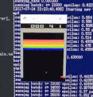
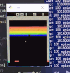

---

layout: post

title: "训练AI玩游戏(2)"

date: "2017-08-16 21:14:43 +0800"

---


上次讲完了Deep Q Network的基本理论, 这次我们以经典的Atari游戏为例, 结合代码实现来看看.

完整代码地址: [https://github.com/codescv/nesgym/blob/master/src/run-atari.py](https://github.com/codescv/nesgym/blob/master/src/run-atari.py)


## 工程细节

虽然Deep Q Network的基本原理非常简单, 但也有很多的工程细节值得讨论.


### Double Q Network

Deep Q Network的一个重要加强叫做Double Q Network. 它是这样工作的: 我们使用两个结构完全相同的Network q_base 和 q_target. 它们的input都是当前state, 而output是所有action对应的value(一个vector). q_base用于选择当前的最佳action, q_target用于近似代替真实的q. 每次训练时, 根据reward和loss function更新q_base的参数, 而每隔一段时间将q_base的参数完全赋值给q_target. 这样做的好处是让参数更新更加稳定. 有兴趣深入了解的同学可以去看[这篇论文](https://deepmind.com/research/publications/deep-reinforcement-learning-double-q-learning/), 里面有更详细的解释.


### Exploitation vs Exploration

在训练刚开始时, 我们的q network完全是随机的; 一段时间学习之后, q network的预测会越来越准. 如果我们只用q network来决定当前的行动, 我们很有可能很快就掉进local minima. 是使用当前的最优方案, 还是尝试新的策略? 是每天都吃最喜欢吃的小龙虾, 还是隔几天就去找找新的好吃的? 这是个很常见的问题, 术语中叫Exploitation vs Exploration.


解决这个问题的方法有多种: 我们使用的是最简单的一种, 称为$$\epsilon$$-greedy. 通俗的讲, 就是先扔个色子, 如果等于1我就去找新的地方, 否则我就还是吃我最喜欢的(在这个例子里$$\epsilon=1/6$$). 当然, $$\epsilon$$不是固定值; 一开始可以设的大一些, 等到后面见的多了, 身经百战了, 就可以设小一点.


当然, 还有其他方法, 比如, 我能不能根据当前q的输出按概率去选择action呢? 答案是可以的, 有些研究表明这种方法有时会得到更好的效果.


### Experience Replay

我们回顾一下q network的更新规则:


$$ q(s, a) = r + \gamma \cdot \max_{a'}{q(s', a')} $$


所以在Double DQN里, 我们的loss可以写成:


$$ loss = (r + \gamma \cdot \max_{a'}{qtarget(s', a') - qbase(s, a)) ^ 2} $$


因此在更新时, 我们需要一个序列(s, a, r, s')来计算loss(注意: 我们更新的是q_base的参数, 前面两项是常数). 在实际的工程中, 我们使用一个replay buffer, 记录很多个历史序列, 然后在学习的时候, 从replay buffer中随机sample出一组(s, a, r, s')的序列来进行训练. 这样能解除样本之间的相关性, 达到比较好的训练效果.


## OpenAI Gym Environment

我们使用OpenAI Gym作为训练环境. 之所以用它是因为它很好的封装了atari游戏的模拟器环境, 让我们可以专注在实现算法的代码上. 一个OpenAI的环境env, 它主要有几个方法:

- `reset` 将重置这个环境, 进入一个新的episode. 返回observation(说明: 在本blog里observation和state是一回事).

- `step(action)` 将在这个环境中进行action, 返回值为一个tuple: `(obs, reward, done, info)`. 其中obs是新的observation, done表示该episode是否结束(比如游戏赢了或者输了), info里是一些跟环境相关的debug信息.

- `render()` 用于渲染当前环境.

然后我们结合代码来看:


```python

def main():

  last_obs = env.reset()

  for step in range(task.max_timesteps):

    env.render()

    action = dqn.choose_action(step, last_obs)

    obs, reward, done, info = env.step(action)

    dqn.learn(step, action, reward, done, info)

    if done:

      last_obs = env.reset()

    else:

      last_obs = obs

```


这是我们的主循环, 应该非常好理解, 就不过多解释了.


## Deep Learning Framework

Deepmind当年使用的framework是torch, 它是基于lua的. 原始的实现在这里:


[https://sites.google.com/a/deepmind.com/dqn/](https://sites.google.com/a/deepmind.com/dqn/)


不过如果你去看它的代码, 有可能会一头雾水, 因为当年的deep learning framework不像现在这么傻瓜化, 很多东西需要手动实现, 看起来会非常复杂.


这篇blog里的代码是基于Keras写的. 主要的原因是我觉得用Keras代码最简单干净, 容易看懂. 之前我还写过一个基于TensorFlow的版本在这里, 如果有兴趣也可以看看:


[https://github.com/codescv/dqn-test/blob/master/hw3/run_dqn_atari.py](https://github.com/codescv/dqn-test/blob/master/hw3/run_dqn_atari.py)


(这是Berkeley CS 294: Deep Reinforcement Learning的课程作业, 也可以去源地址看看, 自己试试从头写, 收获可能会更大.)


对Deep Learning Framework我了解的不多, 只用过Keras和TensorFlow, 所以也没法给出更多建议. 之前看cs231n被安利了一把PyTorch, 像是Torch的升级版, 看起来也挺有意思的. 最大的区别是TensorFlow用的是static graph, 而PyTorch是dynamic graph, 有点类似于static language vs dynamic language, 也有点类似于eager evaluation vs lazy evaluation.


## Q Network Architecture

下面我们来看 q network model的代码:

```python

def q_function(input_shape, num_actions):

    image_input = Input(shape=input_shape)

    out = Conv2D(filters=32, kernel_size=8, strides=(4, 4), padding='valid', activation='relu')(image_input)

    out = Conv2D(filters=64, kernel_size=4, strides=(2, 2), padding='valid', activation='relu')(out)

    out = Conv2D(filters=64, kernel_size=3, strides=(1, 1), padding='valid', activation='relu')(out)

    out = Flatten()(out)

    out = Dense(512, activation='relu')(out)

    q_value = Dense(num_actions)(out)


    return image_input, q_value


def q_model(input_shape, num_actions):

    inputs, outputs = q_function(input_shape, num_actions)

    return Model(inputs, outputs)

```


可以看到, 用Keras构建Neural Network非常的人性化, 你不需要声明一堆变量, 也不用小心翼翼的算每个矩阵是几乘几, 实在是数死早们的福音. (做工程就应该这么做, 不能搞的跟R语言那样.) 当然新版的TensorFlow也加如了Keras的各种API, 实在是很棒棒, 但是它同时还提供了3套大同小异的Layer API(未来或许更多). 也许Google的基因里就写着"分裂"这两个字吧.


我们来简单分析一下这个Q Network的结构: 输入是当前的observation(numpy array), 然后经过若干convolutional layer, 然后是一个fully connected layer, 最后输出一个大小为num_actions的数组, 每一项对应action的q value.


## Double DQN class

最后, 我们有一个类`DoubleDQN`类来实现我们的Agent所需要的方法. 从之前`main`中我们已经看到了两个我们需要实现的方法, 一个是`choose_action`, 用于选择当前的action, 一个是`learn`, 用于驱动学习过程. 我们依次来看:

```python

def __init__(self, ...):

  ...

  # use multiple frames as input to q network

  input_shape = image_shape[:-1] + (image_shape[-1] * frame_history_len,)

  # used to choose action

  self.base_model = q_model(input_shape, num_actions)

  self.base_model.compile(optimizer=optimizers.adam(clipnorm=10, lr=1e-4, decay=1e-6, epsilon=1e-4), loss='mse')

  # used to estimate q values

  self.target_model = q_model(input_shape, num_actions)


  self.replay_buffer = ReplayBuffer(size=replay_buffer_size, frame_history_len=frame_history_len)

  ...

```

我们截取了`__init__`里比较重要的部分来看: 首先我们是把最近`frame_history_len=4`个frame的图像作为q network的输入的. 因为游戏是动态的, 仅靠当前frame并不一定能确定状态(比如速度等). 然后我们使用`q_model`创建了前面所说的两个q network. 在`Optimizer`里面有几个参数, 其中这个`clipnorm`是用来做gradient的截断, 防止巨大跳变. 最后我们创建一个`ReplayBuffer`来存储Agent运行的历史.


```python

def choose_action(self, step, obs):

    self.replay_buffer_idx = self.replay_buffer.store_frame(obs)

    if step < self.training_starts or np.random.rand() < self.exploration.value(step):

        # take random action

        action = np.random.randint(self.num_actions)

    else:

        # take action that results in maximum q value

        recent_obs = self.replay_buffer.encode_recent_observation()

        q_vals = self.base_model.predict_on_batch(np.array([recent_obs])).flatten()

        action = np.argmax(q_vals)

    return action

```

在`choose_action`方法中, 我们首先将当前frame的图像存到`ReplayBuffer`中, 然后我们使用前面介绍的$$\epsilon$$-greedy方法选择action.


```python

def learn(self, step, action, reward, done, info=None):

    self.replay_buffer.store_effect(self.replay_buffer_idx, action, reward, done)

    if step > self.training_starts and step % self.training_freq == 0:

        self._train()


    if step > self.training_starts and step % self.target_update_freq == 0:

        self._update_target()


def _train(self):

    obs_t, action, reward, obs_t1, done_mask = self.replay_buffer.sample(self.training_batch_size)

    q = self.base_model.predict(obs_t)

    q_t1 = self.target_model.predict(obs_t1)

    q_t1_max = np.max(q_t1, axis=1)

    q[range(len(action)), action] = reward + q_t1_max * self.reward_decay * (1-done_mask)

    loss = self.base_model.train_on_batch(obs_t, q)

    self.latest_losses.append(loss)


def _update_target(self):

    weights = self.base_model.get_weights()

    self.target_model.set_weights(weights)

```


可以看到, 我们是每隔一定的step才进行训练(training_freq=4), 然后每隔很长的step才更新target network的参数(target_update_freq > 1000). 这是为了参数更新更加稳定.


在`_train`方法里, 我们使用了前面讲到的loss function来更新参数.


## 效果演示

### 训练前



### 训练后




可以看到，一开始Agent大部分是随机运动，效果很差；经过大约100w个step的training以后，就玩的非常好了。


Deep Q Network的工程细节还是很多的, 这篇文章也是挑出比较重要的讲一讲, 有兴趣的同学可以去看完整的代码, 以及前面讲的paper.


写这段代码最大的感受就是神经网络的代码好难debug，常常有bug也不报错，只是结果坏掉，不知道大家有什么这方面的经验吗？例如我在写的时候，一开始犯了个错误，忘记了更新`last_obs`, 导致agent的输入永远是第1帧。更神奇的是训练了一晚上以后，reward确实有所提高...
